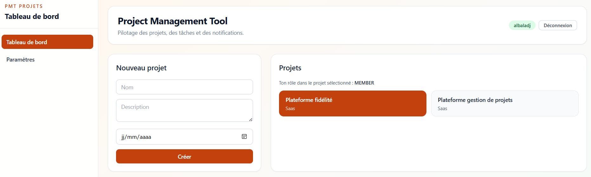
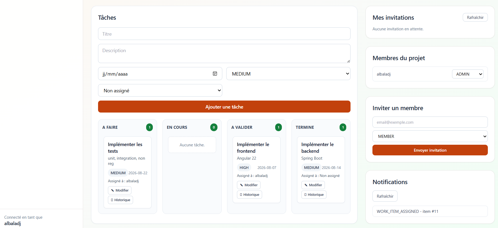
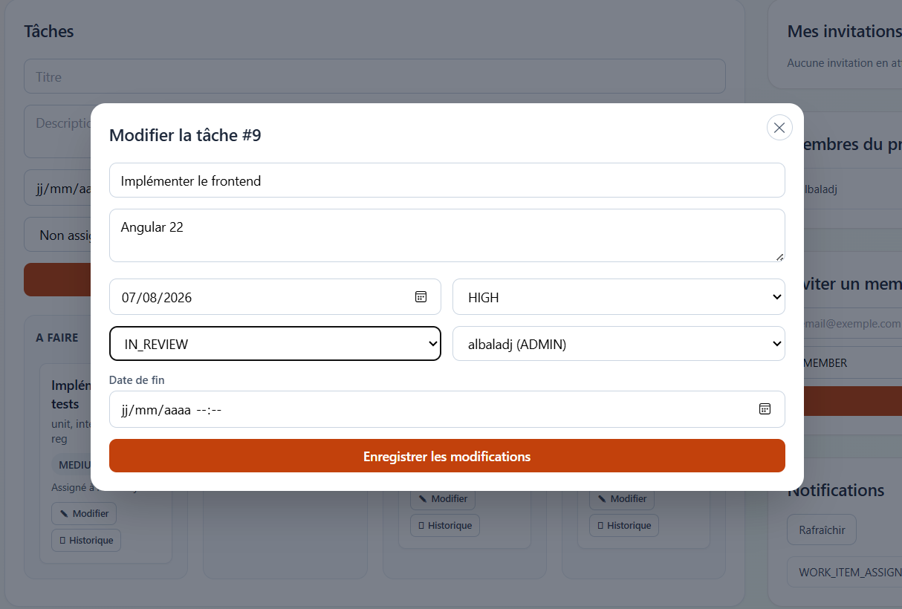

# Phase de conception

## 1) Stack

Frontend : Angular
Backend : Java avec Spring Boot
Base de données : PostgreSQL
Système de versionnement : Git

## 2) Entités

Les entités clés identifiées sont:
- Account : utilisateur enregistré sur la plateforme.
- Workspace : projet collaboratif pouvant être créé par un utilisateur.
- Team_member : participation d'un utilisateur à un projet.
- User_notification : notification liée à une tâche.
- Project_invitation : invitation envoyée.
- Work_item : tâche liée à un projet.
- Work_item_history : historique des changements d'une tâche.

## 3) Schéma base de données


Correspondance détaillée des clés étrangères :
- WORKSPACES.owner_account_id -> ACCOUNTS.id
- TEAM_MEMBERS.workspace_id -> WORKSPACES.id
- TEAM_MEMBERS.account_id -> ACCOUNTS.id
- PROJECT_INVITATIONS.workspace_id -> WORKSPACES.id
- PROJECT_INVITATIONS.invited_by -> ACCOUNTS.id
- WORK_ITEMS.workspace_id -> WORKSPACES.id
- WORK_ITEMS.creator_account_id -> ACCOUNTS.id
- WORK_ITEMS.assigned_account_id -> ACCOUNTS.id
- WORK_ITEM_HISTORY.work_item_id -> WORK_ITEMS.id
- WORK_ITEM_HISTORY.changed_by -> ACCOUNTS.id
- USER_NOTIFICATIONS.account_id -> ACCOUNTS.id
- USER_NOTIFICATIONS.work_item_id -> WORK_ITEMS.id

## 4) Détail

Détail des relations du diagramme :
- ACCOUNTS / WORKSPACES (creates): un compte peut créer 0 à plusieurs workspaces (0..N); chaque workspace a exactement 1 owner_account_id.
- ACCOUNTS / TEAM_MEMBERS (participates) : un compte peut avoir 0 à plusieurs (0..N) enregistrements dans TEAM_MEMBERS (un enregistrement par appartenance à un workspace).
- WORKSPACES / TEAM_MEMBERS (contains) : un workspace contient 0 à plusieurs (0..N) membres; une ligne team_members appartient à un seul workspace.
- WORKSPACES / PROJECT_INVITATIONS (has) : un workspace peut avoir 0 à plusieurs (0..N) invitations.
- ACCOUNTS / PROJECT_INVITATIONS (sends) : un compte peut envoyer 0 à plusieurs (0..N) invitations; chaque invitation a 1 invited_by.
- WORKSPACES / WORK_ITEMS (contains) : un workspace contient 0 à plusieurs (0..N) tâches; chaque tâche appartient à 1 workspace.
- ACCOUNTS / WORK_ITEMS (creates) : un compte peut créer 0 à plusieurs (0..N) tâches; chaque tâche a 1 creator_account_id.
- ACCOUNTS / WORK_ITEMS (assigned) : un compte peut être assigné à 0 à plusieurs (0..N) tâches; une tâche a 0 ou 1 assigned_account_id.
- WORK_ITEMS / WORK_ITEM_HISTORY (has) : une tâche peut avoir 0 à plusieurs (0..N) entrées d'historique.
- ACCOUNTS / WORK_ITEM_HISTORY (modifies) : un compte peut être auteur de 0 à plusieurs (0..N) traces d'historique; chaque trace a 1 changed_by.
- ACCOUNTS / USER_NOTIFICATIONS (receives) : un compte peut recevoir 0 à plusieurs (0..N) notifications.
- WORK_ITEMS / USER_NOTIFICATIONS (concerns) : une tâche peut être liée à 0 à plusieurs (0..N) notifications.


## 5) Processus de déploiement

### Étapes du pipeline CI/CD

1. backend-tests
- Lance les tests backend (Spring Boot).
- Objectif : valider la logique métier, la persistance et les contrôleurs avant toute publication.

2. frontend-tests
- Lance les tests frontend (Angular/Jest).
- Objectif : éviter de publier une interface non fonctionnelle.

3. build-images
- Construit les images Docker backend et frontend.
- Objectif : garantir que l'application est réellement packagée.

4. test-artifacts
- Teste les artefacts Docker en exécution avant publication : reconstruction des images avec le tag du commit, démarrage de la stack via Docker Compose sans build, vérifications d'accessibilité frontend/backend (smoke tests), puis nettoyage de la stack.
- Objectif : valider les artefacts en conditions d'exécution avant push Docker Hub.

5. publish-images
- Publie les images sur le registry (Docker Hub) avec les credentials GitHub Secrets.
- Applique les tags `latest` et SHA du commit.
- Ne s'exécute que si `build-images` et `test-artifacts` sont validés.
- Objectif : déployer les artefacts sur le registry.

6. deploy-app
- Pull explicitement les images publiées (tag SHA), puis démarre la stack sans rebuild local.
- Exécute des tests d'acceptance simples (smoke tests HTTP).
- Objectif : vérifier que les artefacts publiés sont réellement déployables et fonctionnels.

### Justification de l'ordre et déclenchement

L'ordre du pipeline suit une logique de fiabilité : tests du code, construction des artefacts, test runtime des artefacts, publication sur Docker Hub, puis déploiement basé sur les images publiées. Cette séquence limite le risque de publier un artefact non exploitable.

Concernant les déclencheurs, les tests backend et frontend sont lancés à chaque pull request vers `main` ainsi qu'à chaque push (sur `main` et sur `branches/**`). La publication des images et le déploiement ne s'exécutent pas sur les pull requests : ils sont déclenchés uniquement lors d'un push sur `main`.

### Critères de succès du déploiement

Le déploiement est considéré comme réussi lorsque les tests backend et frontend passent, lorsque les artefacts Docker passent les tests runtime pré-publication, lorsque les images sont publiées sur Docker Hub, lorsque la stack démarre avec les images publiées et lorsque les checks d'acceptance retournent les statuts attendus.


## 6) API PMT

La documentation complète des endpoints, paramètres, schémas et réponses est disponible via Swagger :
- Swagger UI : /swagger-ui.html
- OpenAPI JSON : /v3/api-docs

#### Exemple 1 : créer un workspace

```bash
curl -X POST http://localhost:8080/api/workspaces \
  -H "Content-Type: application/json" \
  -d '{
    "name": "PMT Release 1",
    "description": "Workspace de planification release",
    "startDate": "2026-08-01",
    "ownerAccountId": 1
  }'
```

#### Exemple 2 : créer une tâche

```bash
curl -X POST http://localhost:8080/api/workspaces/10/work-items \
  -H "Content-Type: application/json" \
  -d '{
    "title": "Prepare release notes",
    "description": "Draft and review release notes",
    "dueDate": "2026-08-15",
    "priority": "HIGH",
    "creatorAccountId": 1,
    "assignedAccountId": 2
  }'
```

#### Exemple 3 : consulter le dashboard

```bash
curl "http://localhost:8080/api/workspaces/10/dashboard?actorAccountId=1"
```

## 7) Captures d'écran










