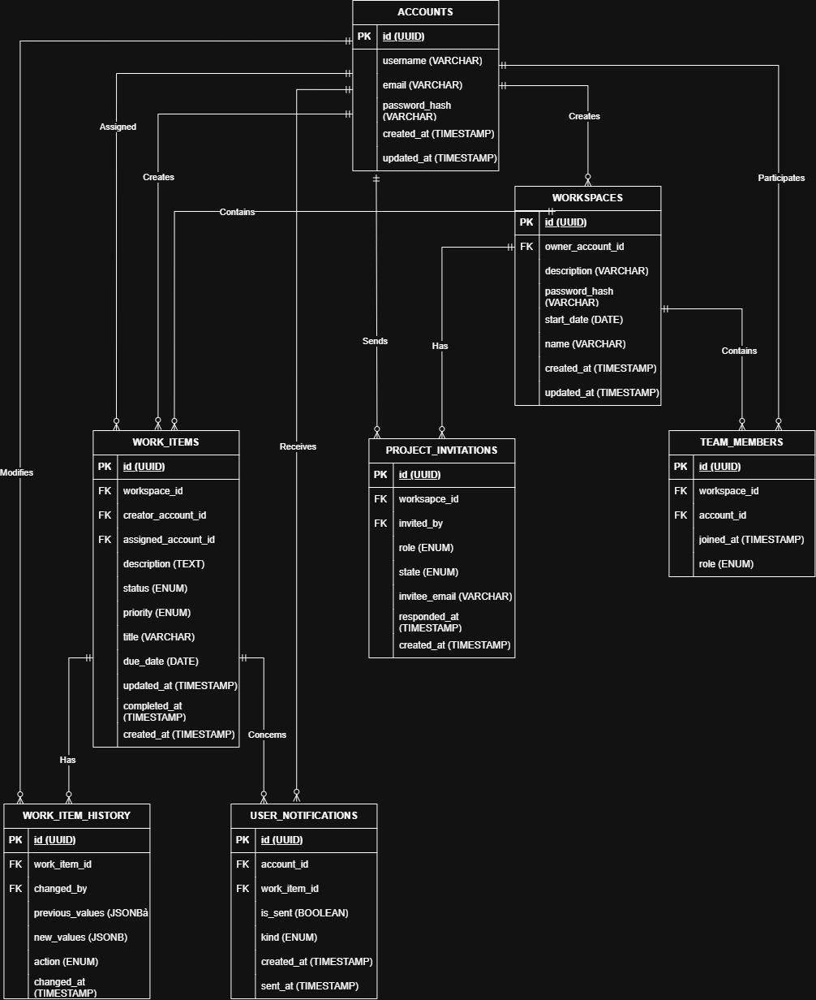

# Phase de conception

## 1) Stack

Frontend : Angular
Backend : Java avec Spring Boot
Base de données : PostgreSQL
Système de versionnement : Git

## 2) Entités

Les entités clés identifiées sont:
- Account : utilisateur enregistré sur la plateforme.
- Workspace : projet collaboratif pouvant être créé par un utilisateur.
- Team_member : participation d'un utilisateur à un projet.
- User_notification : notification liée à une tâche.
- Project_invitation : invitation envoyée.
- Work_item : tâche liée à un projet.
- Work_item_history : historique des changements d'une tâche.

## 3) Schéma base de données

Correspondance détaillée des clés étrangères :
- WORKSPACES.owner_account_id -> ACCOUNTS.id
- TEAM_MEMBERS.workspace_id -> WORKSPACES.id
- TEAM_MEMBERS.account_id -> ACCOUNTS.id
- PROJECT_INVITATIONS.workspace_id -> WORKSPACES.id
- PROJECT_INVITATIONS.invited_by -> ACCOUNTS.id
- WORK_ITEMS.workspace_id -> WORKSPACES.id
- WORK_ITEMS.creator_account_id -> ACCOUNTS.id
- WORK_ITEMS.assigned_account_id -> ACCOUNTS.id
- WORK_ITEM_HISTORY.work_item_id -> WORK_ITEMS.id
- WORK_ITEM_HISTORY.changed_by -> ACCOUNTS.id
- USER_NOTIFICATIONS.account_id -> ACCOUNTS.id
- USER_NOTIFICATIONS.work_item_id -> WORK_ITEMS.id

## 4) Détail

Détail des relations du diagramme :
- ACCOUNTS / WORKSPACES (creates): un compte peut créer 0 à plusieurs workspaces (0..N); chaque workspace a exactement 1 owner_account_id.
- ACCOUNTS / TEAM_MEMBERS (participates) : un compte peut avoir 0 à plusieurs (0..N) enregistrements dans TEAM_MEMBERS (un enregistrement par appartenance à un workspace).
- WORKSPACES / TEAM_MEMBERS (contains) : un workspace contient 0 à plusieurs (0..N) membres; une ligne team_members appartient à un seul workspace.
- WORKSPACES / PROJECT_INVITATIONS (has) : un workspace peut avoir 0 à plusieurs (0..N) invitations.
- ACCOUNTS / PROJECT_INVITATIONS (sends) : un compte peut envoyer 0 à plusieurs (0..N) invitations; chaque invitation a 1 invited_by.
- WORKSPACES / WORK_ITEMS (contains) : un workspace contient 0 à plusieurs (0..N) tâches; chaque tâche appartient à 1 workspace.
- ACCOUNTS / WORK_ITEMS (creates) : un compte peut créer 0 à plusieurs (0..N) tâches; chaque tâche a 1 creator_account_id.
- ACCOUNTS / WORK_ITEMS (assigned) : un compte peut être assigné à 0 à plusieurs (0..N) tâches; une tâche a 0 ou 1 assigned_account_id.
- WORK_ITEMS / WORK_ITEM_HISTORY (has) : une tâche peut avoir 0 à plusieurs (0..N) entrées d'historique.
- ACCOUNTS / WORK_ITEM_HISTORY (modifies) : un compte peut être auteur de 0 à plusieurs (0..N) traces d'historique; chaque trace a 1 changed_by.
- ACCOUNTS / USER_NOTIFICATIONS (receives) : un compte peut recevoir 0 à plusieurs (0..N) notifications.
- WORK_ITEMS / USER_NOTIFICATIONS (concerns) : une tâche peut être liée à 0 à plusieurs (0..N) notifications.
